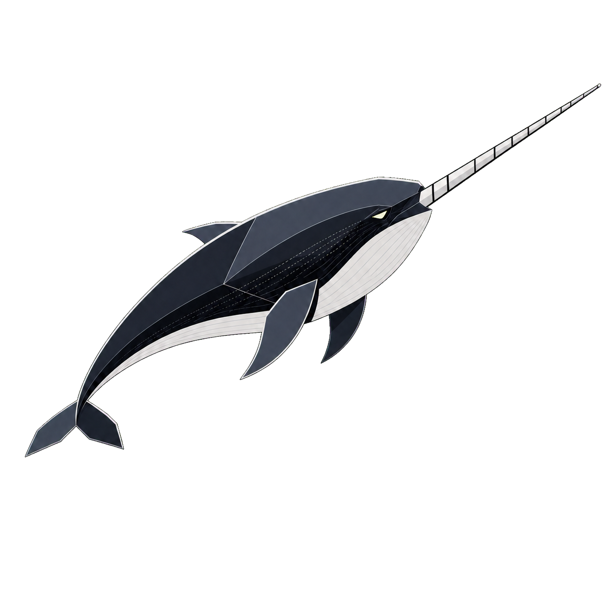
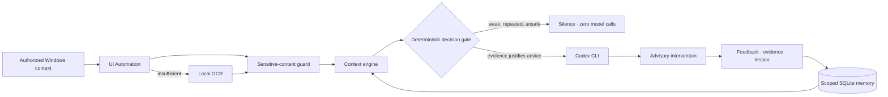

<div align="center">

# KOVACS

### A context-aware operating system for deliberate engineering practice.

Kovacs turns real work into structured goals, timely guidance, reviewable evidence, and better technical judgment — while keeping you in control.



[](./docs/v0.3.3/00_RELEASE_CHARTER.md)
[](#requirements)
[](#requirements)
[](#why-codex-cli)
[](#authority-boundary)

[Quick start](#quick-start) · [How it works](#how-it-works) · [Security](#trust-and-privacy) · [Current scope](#current-scope) · [Roadmap](#roadmap)

</div>

> [!IMPORTANT]
> Kovacs V0.3.3 is a single-user Windows prototype entering a real 5–10 day pilot. Automated release evidence is strong; real-world usefulness is still being measured.

## The problem

Coding agents can help implement a solution. They are less equipped to notice when the engineer is solving the wrong problem, expanding scope too early, losing the active objective, or claiming progress without evidence.

Kovacs works at that layer.

It connects a long-term engineering mission to the work happening on screen, then decides whether the current evidence justifies guidance. Most observations end in silence. When intervention is useful, Kovacs asks Codex CLI for a bounded recommendation and presents it without operating the computer for you.

```text
90-day mission → weekly outcome → daily objective → evidence-bearing checkpoints
                                                    ↓
                                      context-aware guidance
                                                    ↓
                                     End Day + durable lessons
```

## What Kovacs does

| Moment | Kovacs behavior |
| --- | --- |
| Initial calibration | Interprets one natural-language description into a 90-day mission and first rolling week. |
| Before work | Turns a simple daily intention into a measurable objective, success criteria, and ordered checkpoints. |
| During work | Reads authorized Windows context through UI Automation and local OCR, then decides locally whether to remain silent or request advice. |
| At a checkpoint | Records the concrete result, validation method, assistance used, and evidence source. |
| When context changes | Retrieves relevant global and project-scoped memory before forming a recommendation. |
| End of day | Separates output, validation, missing proof, lesson, and carry-forward work for confirmation. |
| After restart | Recovers unfinished state but never resumes observation without the user. |

### A typical session

1. You write: _“I need to move the retrieval system forward today.”_
2. Kovacs proposes a sharper objective, success evidence, and two to six checkpoints.
3. You review and approve the operating contract.
4. Kovacs observes authorized applications locally while you work.
5. Unchanged or weak context produces no model call.
6. A relevant failure, context shift, or manual **Observe Now** request may produce one advisory intervention.
7. You record evidence, classify the assistance used, and explicitly close the day.

## How it works



### Perception cascade

Kovacs uses the least invasive useful signal:

1. active application and transient window metadata;
2. Windows UI Automation text;
3. one local screenshot for OCR when UIA is insufficient;
4. screenshot attachment to Codex only when additional visual context is necessary and the local guard can establish that it is safe.

Raw OCR text, accessibility text, screenshots, and window titles are not retained by default.

### Context decision engine

Local deterministic policy evaluates:

- semantic change;
- confidence and conflicting signals;
- strong versus weak context deltas;
- deterministic failure triggers;
- same-context cooldown;
- user feedback from previous interventions;
- possible prompt-injection-like screen content.

Sampling the screen does not imply calling a model. The normal result is silence.

### Memory and retrieval

Memory is local, inspectable, and user-controlled:

- SQLite FTS5 plus a deterministic local vector;
- global or project scope;
- kind and sensitivity filters;
- `fts_vector`, `fts_only`, and `lexical_fallback` retrieval paths;
- confirmation for inferred memory;
- pin, unpin, delete, retention, export, and backup;
- diagnostics containing hashes, identifiers, scores, and provenance — not raw queries.

## Trust and privacy

Kovacs treats screen content as untrusted input, not as instructions.

| Risk | Control |
| --- | --- |
| Credentials or private text on screen | Tokens, keys, credentials, email addresses, connection strings, and configured restricted terms are redacted locally. |
| Sensitive screenshot | Screenshot attachment fails closed when sensitive content is detected. |
| Image cannot be inspected | If OCR is unavailable, the screenshot is withheld. |
| Prompt injection on screen | Injection-like text cannot trigger automatic reasoning. |
| Silent surveillance | Observation starts only after daily-plan approval and can be paused or made private at any time. |
| Restart surprise | Recovered sessions require manual observation resume. |
| Unverifiable progress | Self-reported evidence is never silently promoted to tool- or artifact-verified evidence. |
| External side effects | The runtime is advisory-only and cannot click, type, send, submit, publish, or commit. |

### Authority boundary

Kovacs can:

- observe explicitly authorized applications;
- structure goals and work;
- draft recommendations;
- retrieve relevant memory;
- record user-confirmed evidence and lessons.

Kovacs cannot:

- control the mouse or keyboard;
- modify project files;
- send messages or emails;
- submit applications;
- publish social content;
- perform post-session actions;
- silently expand its own permissions.

## Quick start

### Requirements

- Windows 10 or 11
- Node.js 22.12 or newer
- an installed and authenticated Codex CLI

### Install and validate

```powershell
git clone https://github.com/DerMayer1/Kovacs.git
cd Kovacs
npm install
npm run v033:validate
```

The V0.3.3 gate runs previous-version regressions, migrations, privacy checks, recovery tests, Electron security checks, the retrieval benchmark, typecheck, build, and dependency audit.

### Launch Kovacs

```powershell
npm run kovacs
```

On first run:

1. describe your current reality in natural language;
2. correct or clarify Kovacs' interpretation;
3. confirm the proposed 90-day mission and first week;
4. provide a real local project directory and today's intention;
5. review the structured daily proposal;
6. select **Approve & Start Day**.

Observation can be toggled with `Ctrl + Alt + K`. **Pause** and **Private** perform no capture. To request an immediate reading, focus an authorized application and select **Observe Now** within 30 seconds.

### Protect project-specific terms

Add terms that should always be redacted before starting Kovacs:

```powershell
$env:KOVACS_RESTRICTED_TERMS="Client Omega,Project Atlas"
npm run kovacs
```

## Current scope

### Available in V0.3.3

- natural-language initial calibration;
- reviewable 90-day mission and rolling week;
- structured daily objectives and checkpoints;
- local Windows context through UIA and OCR;
- deterministic intervention policy;
- manual **Observe Now**;
- checkpoint lifecycle and sourced evidence;
- competency state grounded in practice;
- structured, confirm-before-write End Day;
- local scoped memory and retrieval diagnostics;
- restart recovery, retention, export, and backup;
- explicit intervention feedback.

### Not available yet

- Google Meet captions or Meeting Mode;
- microphone or audio transcription;
- Career Mode, CV, application, or social-media workflows;
- autonomous computer control;
- background actions after a session;
- direct OpenAI API integration;
- macOS or Linux support.

## Release evidence

V0.3.3 currently passes:

- **56/56 automated tests**;
- **14/14 release-gate metrics**;
- **90% Top-5 recall** on the current deterministic 10-case retrieval corpus;
- TypeScript typecheck and production build;
- high-severity dependency audit;
- additive migration and restart-recovery checks.

These numbers describe the current repository test suite and internal benchmark. They are not claims of production accuracy or general retrieval quality.

Run the no-model retrieval benchmark independently:

```powershell
npm run v033:evaluate
```

Run the real schema-constrained Codex acceptance separately — it consumes model usage:

```powershell
npm run v032:live -- "C:\path\to\an\authorized\project"
```

## Why Codex CLI

Codex CLI is the only model gateway in the current architecture. Kovacs does not integrate with the OpenAI API directly.

Planning and advisory calls run ephemerally with schema-constrained output, denied approval, disabled web search, ignored user configuration, and a read-only sandbox. Deterministic local logic owns routine observation, state transitions, retrieval, and model-call decisions.

## Local data

Kovacs stores its state outside target repositories:

```text
%LOCALAPPDATA%\Kovacs\v0.3\kovacs.db
%LOCALAPPDATA%\Kovacs\v0.3\ambient\
%LOCALAPPDATA%\Kovacs\v0.3\v01-sessions\
```

Default application authorization and denied-title patterns are written to:

```text
%LOCALAPPDATA%\Kovacs\v0.3\ambient\settings.json
```

Denied title patterns override the application allowlist.

## Development

| Command | Purpose |
| --- | --- |
| `npm run kovacs` | Build and launch the V0.3.3 desktop presence. |
| `npm run pet` | Legacy alias for `npm run kovacs`. |
| `npm run typecheck` | Validate TypeScript without emitting files. |
| `npm test` | Run the complete automated test suite. |
| `npm run build` | Build the project. |
| `npm run v033:smoke` | Exercise the V0.3.3 trust and retrieval integration locally. |
| `npm run v033:evaluate` | Run the deterministic retrieval corpus without model usage. |
| `npm run v033:validate` | Run the complete layered release gate. |

The historical gates remain independently runnable when isolating a regression:

```powershell
npm run v03:validate
npm run v031:validate
npm run v032:validate
npm run v033:validate
```

The original terminal tutor remains available:

```powershell
npm run dev -- start "C:\path\to\project" "Diagnose the failing integration test" training
npm run dev -- coach ses_... "Help me choose the next diagnostic step" A2
```

## Repository map

```text
src/v01/      Codex CLI gateway, contracts, privacy, terminal tutor
src/v02/      Ambient observer, authorization, capture policy
src/v03/      Daily operating system, SQLite state, Electron runtime
src/v032/     Context engine, Windows perception, local vectors
src/v033/     Sensitive-content trust boundary
ui/v0.3/      Always-on-top Kovacs desktop presence
contracts/    Schema-constrained model and state contracts
test/         Layered regression and release tests
benchmarks/   Deterministic retrieval evaluation corpus
docs/         Architecture, charters, policies, and pilot protocol
```

Start with:

- [V0.3.3 release charter](./docs/v0.3.3/00_RELEASE_CHARTER.md)
- [Trust and retrieval design](./docs/v0.3.3/01_TRUST_AND_RETRIEVAL.md)
- [V0.3.3 acceptance criteria](./docs/v0.3.3/02_ACCEPTANCE.md)
- [5–10 day pilot protocol](./docs/v0.3.1/02_PILOT_PROTOCOL.md)
- [Context Foundation architecture](./docs/v0.3.2/00_CONTEXT_FOUNDATION_CHARTER.md)

## Roadmap

- **Now — V0.3.3 pilot:** measure usefulness, false interventions, latency, privacy, recovery, and Codex consumption during real work.
- **Next — reliability hardening:** turn pilot failures into explicit perception and product requirements.
- **Planned — V0.4 Google Meet Advisory Mode:** caption-first, real-time, advisory guidance with no autonomous post-meeting actions.

The roadmap is directional.

## Design principles

1. **Direction before implementation.** Kovacs helps identify the right next move; coding agents handle deep code work.
2. **Evidence before confidence.** Competence is demonstrated through sourced practice outcomes.
3. **Local before remote.** Cheap deterministic checks happen before model calls.
4. **Silence is a valid result.** No intervention is better than a weak interruption.
5. **User authority is absolute.** Every durable plan, sensitive memory, and meaningful transition remains reviewable.
6. **No capability theater.** Automated metrics, live acceptance, and real-world pilot evidence are reported separately.

---

<div align="center">

**Kovacs does not try to replace the engineer. It is built to make the engineer's judgment more deliberate, visible, and reviewable.**

</div>
